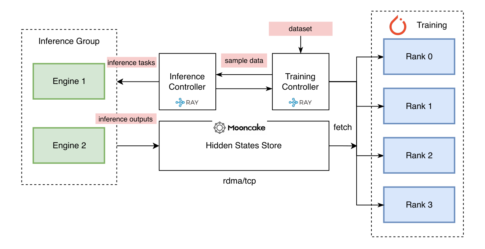

# TorchSpec

TorchSpec is a torch-native speculative decoding training framework. We introduce a disaggregated way of training speculative decoding draft models where inference and training are fully decoupled and stream hidden states directly from inference engine groups to distributed training workers via Mooncake (RDMA/TCP) store, allowing each side to scale independently.

<p align="center">
  
</p>

## Setup

```bash
./tools/build_conda.sh
micromamba activate torchspec
```

To install into your current environment instead: `./tools/build_conda.sh current`

Optional — install Flash Attention:

```bash
pip install -e ".[fa]"
```

## Quick Start

Train an Eagle3 draft model for Qwen3-8B using inference engine (4 GPUs: 2 training + 2 inference):

```bash
./examples/qwen3-8b-single-node/run.sh
```

Override any config value via CLI:

```bash
./examples/qwen3-8b-single-node/run.sh training.learning_rate=5e-5 training.num_train_steps=500
```

## Examples

| Example | Backend | Model |
|---------|---------|-------|
| [hf-quickstart](examples/hf-quickstart/) | HuggingFace | Qwen3-8B |
| [qwen3-8b-single-node](examples/qwen3-8b-single-node/) | Inference Engine | Qwen3-8B |
| [kimi-k25-2node-h200](examples/kimi-k25-2node-h200/) | Inference Engine | Kimi-K2.5 |
| [kimi-k25-3node-h100](examples/kimi-k25-3node-h100/) | Inference Engine | Kimi-K2.5 |

See [examples/README.md](examples/README.md) for details.

## Checkpoint Conversion

Convert an FSDP checkpoint to HuggingFace format:

```bash
python tools/convert_to_hf.py --input-dir ./outputs/my_experiment/iter_0010000/
```

Vocabulary pruning — reducing the draft model's `lm_head` to a smaller token set and emitting `d2t`/`t2d` mappings — can be applied either **during training** (pre-pruning) or **at conversion time** (post-pruning):

- **Pre-pruning**: set `draft_vocab_size` in your training config. The checkpoint already contains the pruned `lm_head` and `d2t`/`t2d` buffers. Use the basic conversion command above — no extra flags needed.

- **Post-pruning**: train with the full vocabulary, then prune at conversion time by passing `--prune-vocab` along with a representative dataset to compute token frequencies:

```bash
python tools/convert_to_hf.py \
    --input-dir ./outputs/my_experiment/iter_0010000/ \
    --prune-vocab \
    --dataset-path Aeala/ShareGPT_Vicuna_unfiltered \
    --draft-vocab-size 32000 \
    --tokenizer Qwen/Qwen3-8B \
    --chat-template qwen \
    --prompt-key conversations
```

Pass `--cache-dir ./cache` to reuse the tokenized dataset cache from training.

## Metrics Reporting

W&B logging is disabled by default (`report_to: none`). To enable it, set `report_to: wandb` in your config and supply your API key.

## Troubleshooting

Set `TORCHSPEC_LOG_LEVEL=DEBUG` for verbose logging when diagnosing issues:

```bash
TORCHSPEC_LOG_LEVEL=DEBUG ./examples/qwen3-8b-single-node/run.sh
```

| Issue | Reference |
|-------|-----------|
| Stuck or failing distributed runs, Ray actor errors | [docs/debugging_ray_jobs.md](docs/debugging_ray_jobs.md) |
| Ray cluster setup, actor hierarchy, placement groups | [docs/ray.md](docs/ray.md) |
| Pipeline bottlenecks, slow steps, throughput analysis | [docs/performance_metrics.md](docs/performance_metrics.md) |
